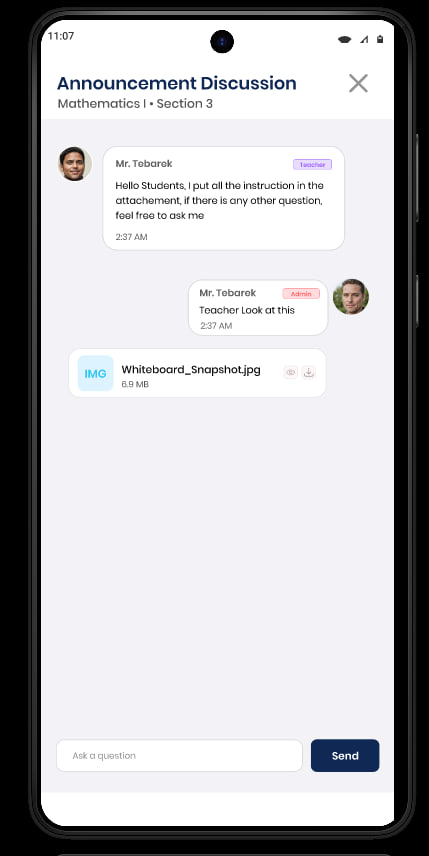
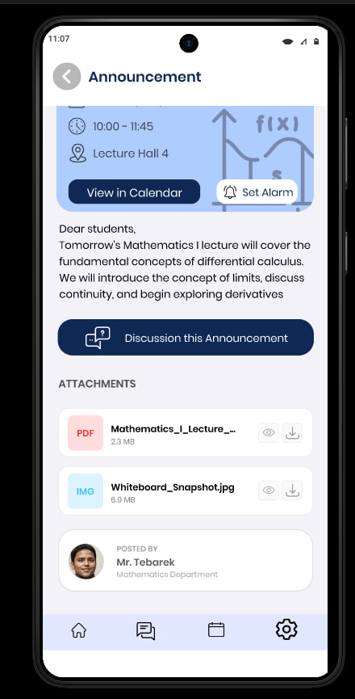
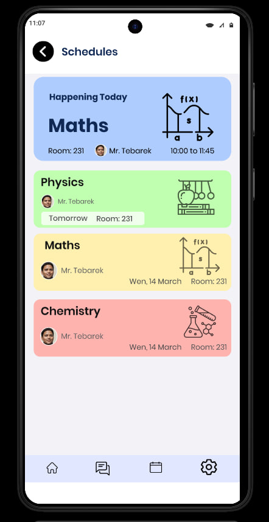
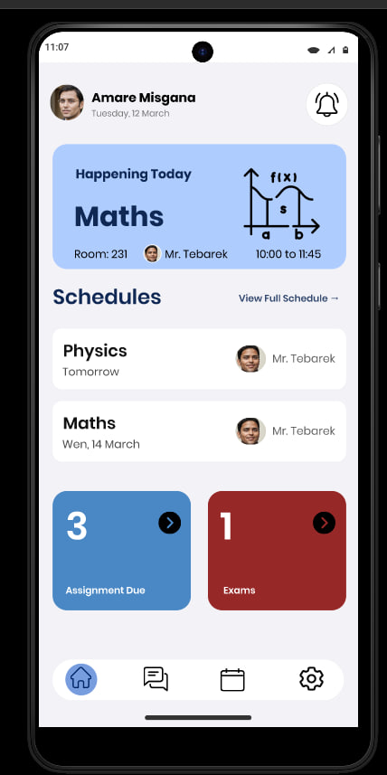
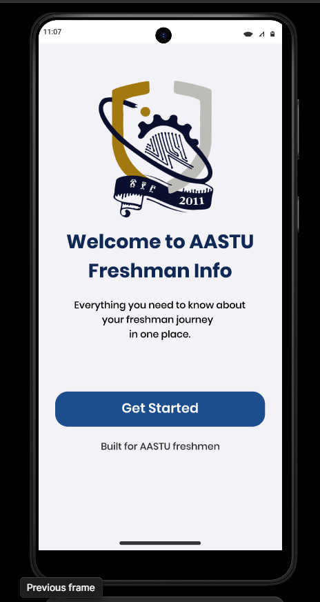
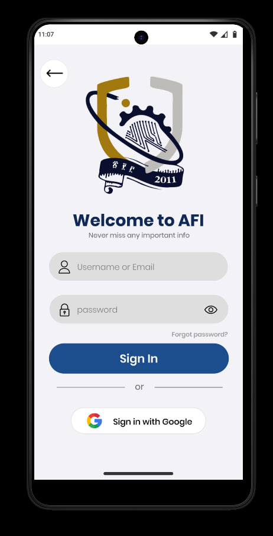

# AFI Mobile Communication Portal

**Status:** Under Active Development

## Overview

The AFI Mobile Communication Portal is a mobile platform designed for academic communication between students, instructors, and administrators. It provides features for managing course announcements, class schedules, reminders, and interactive discussions.

## Screenshots

  
  
  

  
  
  

